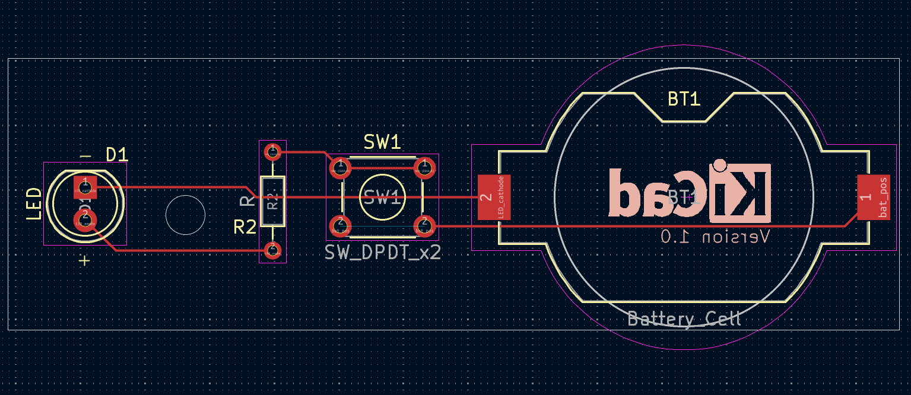
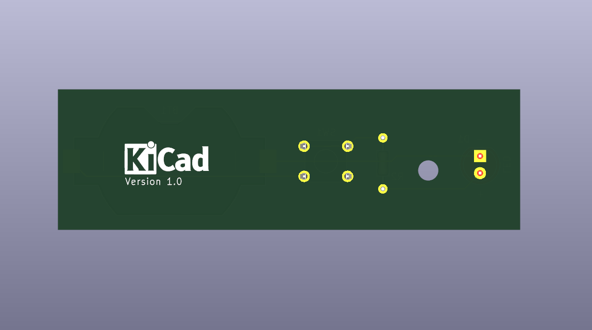

# Project 1 — LED Torch

PCB image used in the project:

<!-- If the relative path doesn't work in your viewer, you can use an absolute Windows path (not recommended for shared repositories): -->
<!--  -->

Description:

This repository contains the files related to the PCB design for the LED Torch project. The image above shows the main PCB.

Additional images:

- 3D View (front):

  

- 3D View (back):

  

- Schematic:

  

